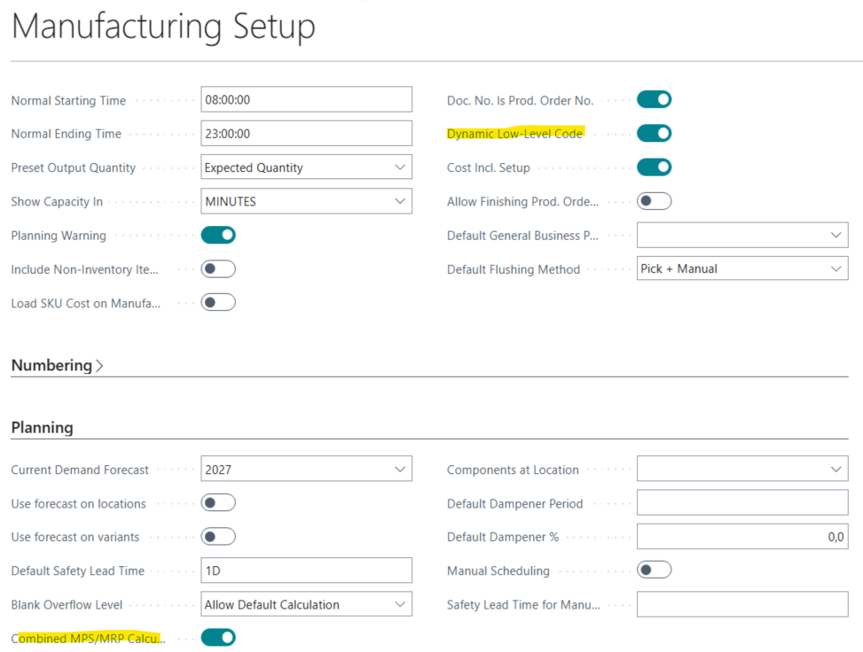
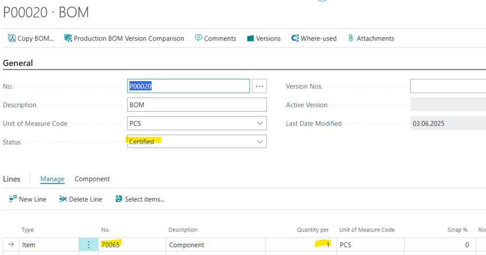
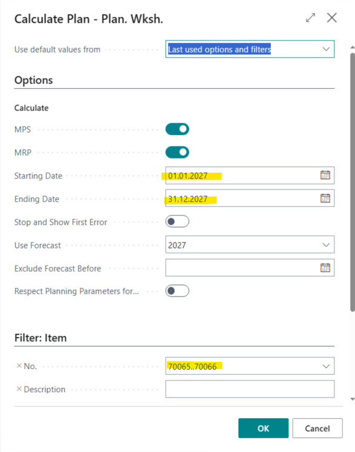
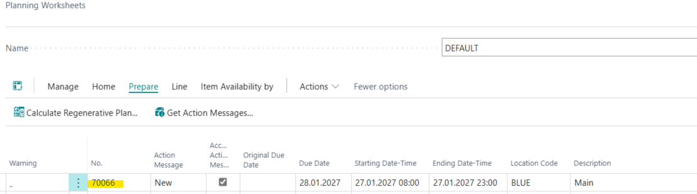
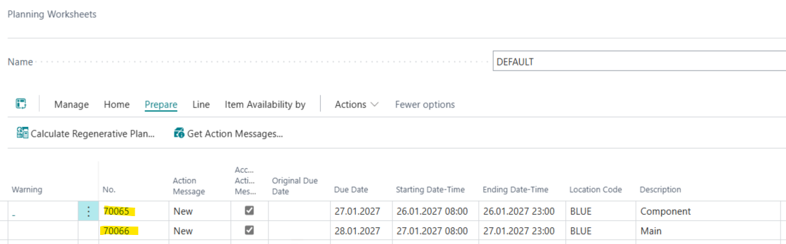

Title: "Calculate Regenarative Plan" in a planning worksheet does not plan the component when Stockkeeping Units are setup for the items.
Repro Steps:
1.  Open BC 26.1 W1 on Prem
2.  Open the manufacturing Setup
    
3.  Search for Items 
    Create a new Item 
    Item: Component (70065 )
    use the Item Template do nothing else 
    Create SKU for Location BLUE
    Open the SKU -> Related -> Warehouse -> Stockkeeping Units
    Replenishment System: Purchase
    Reorder Policy: Order
4.  Search for Production BOM
    Create the following BOM
    
5.  Search for Items 
    Create a new Item 
    Item: Main (70066)
    use the Item Template do nothing else 
    Create SKU for Location BLUE
    Open the SKU -> Related -> Warehouse -> Stockkeeping Units
    Replenishment System: Prod. Order
    Manufactiuring Policy: Make to Stock
    Prodcution BOM No.: P00020
    Reorder Policy: Lot for Lot
6.  Search for Sales Orders
    Create a new Sales Order
    Customer: 10000
    Item :  70066 (Main)
    Location: BLUE
    Quantity: 10
7.  Open Your Settings
    Change the Workdate to: 01.01.2027
8.  Search for Planning Worksheet
    Prepare -> Calculate Regenerative Plan
    

ACTUAL RESULT:
Just one line was created for the Main Item but the component was not planned:

Run the Calculate Regenerative Plan again.
Now the Component is planned also:

EXPECTED RESULT:
Both lines should be calculated with the first Calculate Regenrative Plan

ADDITIONAL INFORMATION:
This works as expected in BC 25.7

Description:
When you run "Calculate Regenarative Plan" in a planning worksheet the component is not planned in the first run, but in the second attempt it is planned.
