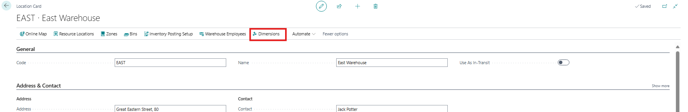
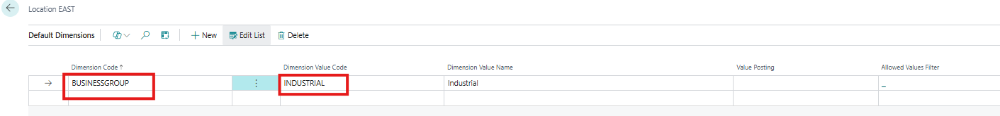
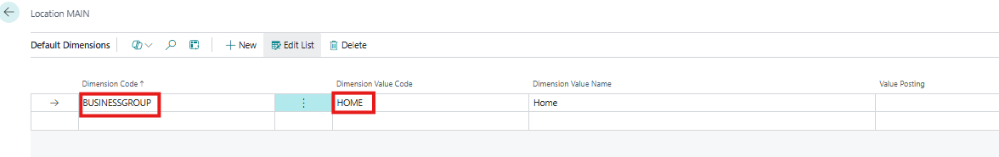
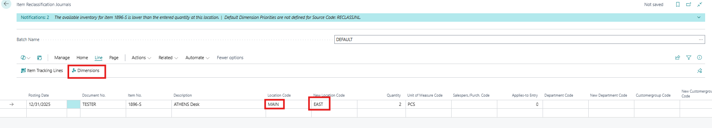
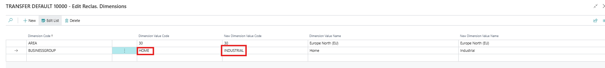
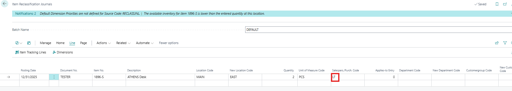
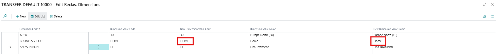

Title: In the Item Reclassification Journal is the Dimension value wrongly updated by adding a Sales Person to the line
Repro Steps:
1- Insert dimensions in the East and Main location as following: 

2- Open the item reclassification journals and fill in the fields as following then open the dimensions:

3- Return back to the lines and add a salesperson code that has a dimension:

**Actual Outcome:**
The "new dimension value code" is changed the original dimension value code: HOME

**Expected Outcome:**
The new dimension value code should keep its value INDUSTRIAL which comes from the new location.

Description:
The new dimension value appears to be incorrect after the salesperson is inserted.
