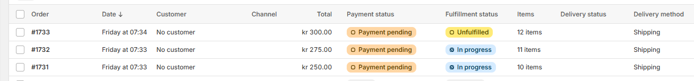
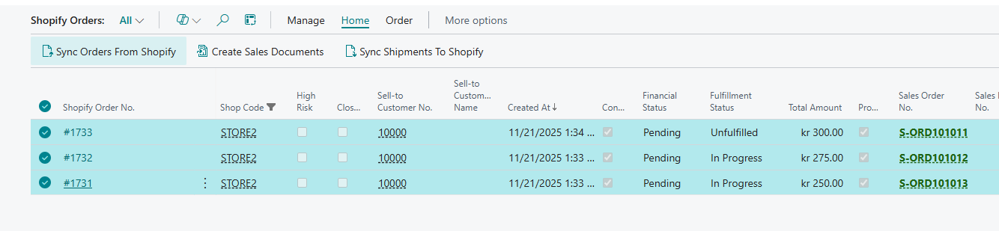
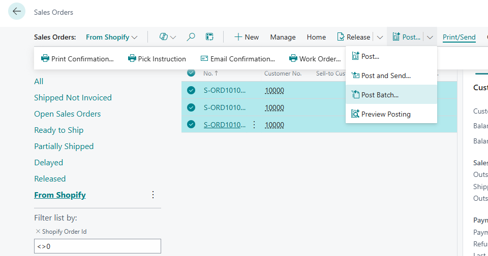
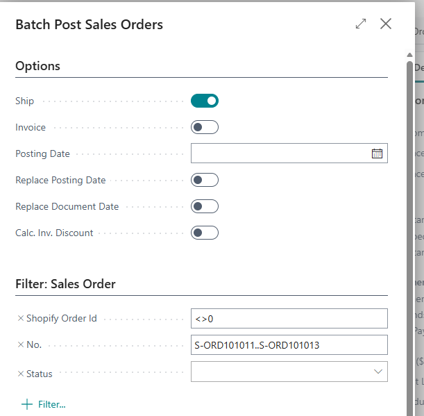
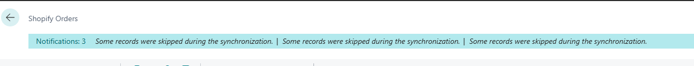
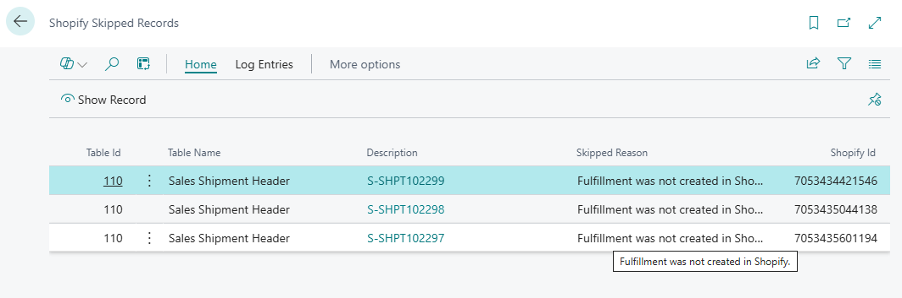
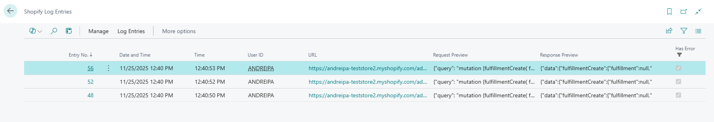
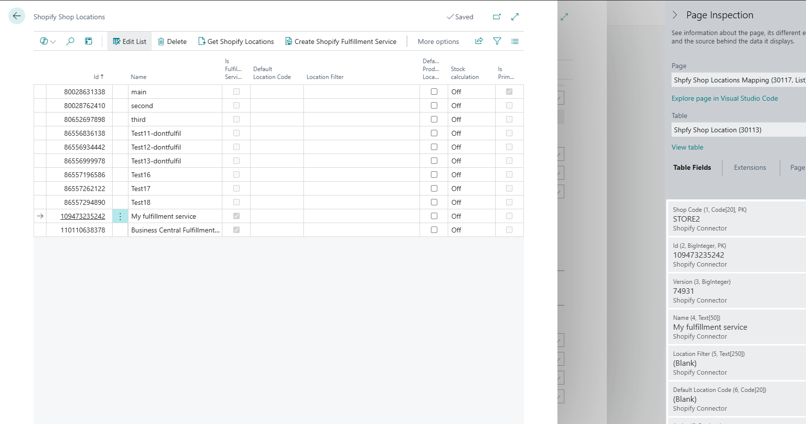

# Shopify - error handling of fulfilment of orders that are associated with 3rd party services

you need to import orders 

1733
1732
1731
(with tag 3rd)

Connect BC to Shopify. Logging = full.
Use default customer.
auto create items = true, item template = something.

Reset order sycn. date = 11/20/2025

Navigate to orders, sync orders. filter by tag *3rd*

Create orders in Business Central (customer is default, item to be created autoamtically)

naviagate to sales orders, find these orders and use Batch Post to post shipment only

Back t Shopify orders, run Sync Shipment to Shopify

You get notification:

IF you check Shop log,
There were attempts to create fulfilments:

but they failed:

Request:
{"query": "mutation {fulfillmentCreate( fulfillment: {notifyCustomer: true, lineItemsByFulfillmentOrder: [{fulfillmentOrderId: "gid://shopify/FulfillmentOrder/8077883081002 ",fulfillmentOrderLineItems: [{id: "gid://shopify/FulfillmentOrderLineItem/18126922350890 ",quantity: 10}]}]}){fulfillment { legacyResourceId name createdAt updatedAt deliveredAt displayStatus estimatedDeliveryAt status totalQuantity location { legacyResourceId } trackingInfo { number url company } service { serviceName type } fulfillmentLineItems(first: 10) { pageInfo { endCursor hasNextPage } nodes { id quantity originalTotalSet { presentmentMoney { amount } shopMoney { amount }} lineItem { id isGiftCard }}}}, userErrors {field,message}}}"}

Response:
{"data":{"fulfillmentCreate":{"fulfillment":null,"userErrors":[{"field":["fulfillment"],"message":"The api_client does not have access to the fulfillment order."}]}},"extensions":{"cost":{"requestedQueryCost":23,"actualQueryCost":10,"throttleStatus":{"maximumAvailable":2000.0,"currentlyAvailable":1990,"restoreRate":100.0}}}}

Is it expected behavior that we both fail in Shopify Logs and also in Skipped entries?

Can we skip exporting this Shipment if it is associated with fulfilment from 3rd party?(i can see we import list of locations anyway)

